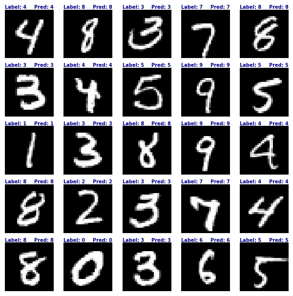

# <h1 align="center">**Image Classification**</h1>

 

In this repository, models for image classification are implemented, a fundamental task in Computer Vision that involves assigning a label or class to a given image. The inputs are pixel values that make up the image, either in grayscale or RGB format, and the goal of the model is to predict the class to which the image belongs.

Some of the models presented in this repository are built and trained from scratch using Convolutional Neural Networks (CNNs). In other cases, transfer learning and/or fine-tuning is applied, leveraging models previously trained on large datasets using TensorFlow and Hugging Face. This approach allows for high performance with lower computational costs. Additionally, Google Colab's TPU is utilized in most models to accelerate training or fine-tuning; in the minority of cases where the TPU is not used, Colab's GPU is employed.

In most of the notebooks, data augmentation techniques are applied to the training set to improve the model's generalization. The TensorFlow Early Stopping callback is also used to prevent overfitting and achieve the best possible results.

Some of the most important use cases for image classification include medical image classification, photo categorization on social media, and inventory product detection. These use cases have a significant impact on various industries such as healthcare, e-commerce, and content management on digital platforms.

If you're interested in exploring other Computer Vision tasks beyond Image Classification, you can visit my [repository](https://github.com/JersonGB22/ComputerVision).

## **Implemented Models:**

- **Binary Image Classification with the [Cats Vs Dogs](https://www.microsoft.com/en-us/download/details.aspx?id=54765) Dataset:** This dataset contains 25,000 RGB images of cats and dogs (23,262 excluding corrupted images), with 80% allocated for training and 20% for testing. First, a **Convolutional Neural Network (CNN)** model is implemented and trained from scratch, achieving an accuracy of **97.46%** on the test dataset. Then, the **Vision Transformer (ViT)** model available on Hugging Face is fine-tuned with the same dataset, achieving an accuracy of **99.72%** on the test dataset.

- **Image Classification with the [MNIST](https://yann.lecun.com/exdb/mnist/) Dataset:** This dataset contains 70,000 grayscale images of handwritten digits from 0 to 9 (10 classes), with 60,000 for training and 10,000 for testing. The **LeNet-5** model is built and trained from scratch, achieving an accuracy of **99.13%** on the test dataset.

- **Image Classification with the [CIFAR-10](https://www.cs.toronto.edu/%7Ekriz/cifar.html) Dataset:** This dataset contains 60,000 color (RGB) images distributed across 10 classes, with 50,000 for training and 10,000 for testing. First, a **Convolutional Neural Network (CNN)** model is implemented and trained from scratch, achieving an accuracy of **90.21%** on the test dataset. Next, transfer learning and fine-tuning are applied to the **EfficientNetV2-L** model available on TensorFlow, achieving an accuracy of **98.1%** on the test dataset. Then, the **EfficientNetV2-XL** model available on TensorFlow Hub is fine-tuned, reaching an accuracy of **99.04%** on the test dataset. Finally, the **ConvNeXt V2** model available on Hugging Face is fine-tuned with the same dataset, achieving an accuracy of **99.32%** on the test dataset.

- **Image Classification with the [CIFAR-100](https://www.cs.toronto.edu/%7Ekriz/cifar.html) Dataset:** This dataset contains 60,000 color (RGB) images distributed across 100 classes, with 50,000 for training and 10,000 for testing. The **ConvNeXt V2** model available on Hugging Face is fine-tuned with this dataset, achieving an accuracy of **94.44%** on the test dataset.

- **Fine-Grained Image Classification with the [Oxford-IIIT Pet](https://www.robots.ox.ac.uk/%7Evgg/data/pets/) Dataset:** This dataset contains RGB images, with 3,680 images for training and 3,669 for testing, distributed across 37 different classes (breeds of dogs and cats). The **ConvNeXt V2** model available on Hugging Face is fine-tuned with this dataset, achieving an accuracy of **96.24%** on the test dataset.

- **Fine-Grained Image Classification with the [CUB-200-2011](https://www.vision.caltech.edu/datasets/cub_200_2011/) Dataset:** This dataset contains 11,788 RGB images, with 5,994 images designated for training and 5,794 for testing, distributed across 200 different bird species. The **ConvNeXt V2** model available on Hugging Face is fine-tuned with this dataset, achieving an accuracy of **91.65%** on the test set. Additionally, another **ConvNeXt V2** model is fine-tuned using the same dataset and adding nearly 20,000 images (about 100 per class of CUB-200-2011) from the [eBird](https://ebird.org/explore) website to the CUB-200-2011 training dataset to enhance the results, reaching an accuracy of **93.04%** on the test dataset.

## **Some Results**

  <h2><b>Cats Vs Dogs Dataset</b></h2>
  

---

  <h2><b>CIFAR-100 Dataset</b></h2>
  

---

  <h2><b>Oxford-IIIT Pet Dataset</b></h2>
  

---

  <h2><b>CUB-200-2011</b></h2>
  

---

  <h2><b>CIFAR-10 Dataset</b></h2>
  

---

  <h2><b>MNIST Dataset</b></h2>
  

#### *More results can be found in the respective notebooks.*

## **Technological Stack**
 

## **Contact**

